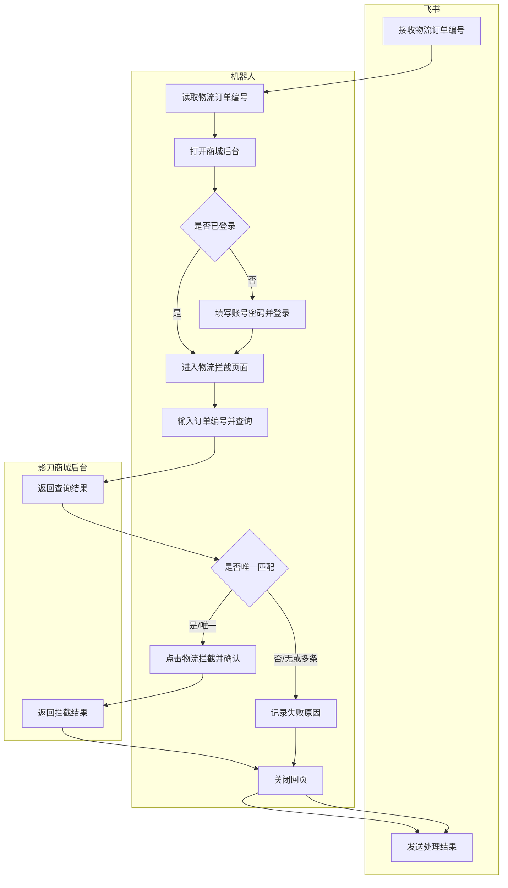

# Logistics Intercept Example

Use this as a compact example of applying the workflow.

## Requirement One-Liner

When a Feishu robot receives a logistics order number, the robot opens the Yingdao Mall backend, searches the logistics interception page, intercepts the unique matching order when available, and sends the processing result back to Feishu.

## Boundary

- Start: Feishu robot receives a logistics order number.
- End: Interception result is sent back to Feishu.
- Stop condition: The web page is closed and the result notification is complete.

## Inputs, Outputs, Platforms

- Input: Logistics order number from Feishu. Example format: `U2021062310545`.
- Output: Feishu message containing success or failure result.
- Platforms: Feishu client/robot, browser, Yingdao Mall backend.
- Access risks: backend login state, account/password, possible verification.

## Business Flow

1. Read the logistics order number from the Feishu robot conversation.
2. Search for the logistics order in the backend.
3. Intercept the unique matching order when allowed.
4. Send the processing result to Feishu.

## System Operation Flow

1. Open the Yingdao Mall logistics interception page.
2. Log in if the backend is not already logged in.
3. Open the logistics interception function.
4. Enter the logistics order number into the search/interception input box.
5. Submit the query.
6. Read whether the query result is empty, unique, or multiple.
7. Open the interception confirmation for the unique matching record.
8. Read the interception result.
9. Return to Feishu and send the result.

## RPA Atomic Action Flow

1. Read the logistics order number from the Feishu robot conversation.
2. Open the browser and navigate to the backend URL.
3. Wait for either the login page or the logistics interception page.
4. If login is required, fill the account field, fill the password field, and click the login button.
5. Wait for the workbench navigation area.
6. Click the logistics interception navigation entry.
7. Wait for the interception input box.
8. Type the logistics order number into the interception input box.
9. Click the query button.
10. Wait for the result list, no-result message, timeout, or verification challenge.
11. Judge whether the result is empty, unique, or multiple.
12. If exactly one record exists, click the logistics interception button and confirm.
13. Read order number, order identifier, order amount, order time, current status, and processing result when available.
14. Close the web page.
15. Compose and send the Feishu success or failure message.

## Exception Branches

- Already logged in: skip login and continue.
- No matching record: skip interception, record failure reason, send failure message to Feishu.
- Multiple matching records: stop automatic interception, record ambiguity, send manual-confirmation message.
- Login failure or verification appears: pause for human intervention or return blocked status.
- Page timeout: retry within agreed limit, then notify failure.

## Mermaid Example

## Requirement Document Writing Guidance

The human document owner should collect:

- Screenshot of the Feishu robot message format.
- Screenshot of the backend login page, if login may be required.
- Screenshot of the logistics interception navigation entry.
- Screenshot of the order-number input box and query button.
- Screenshots for unique match, no match, and multiple match results.
- Screenshot of the interception confirmation result.
- Exact success and failure message templates sent to Feishu.
