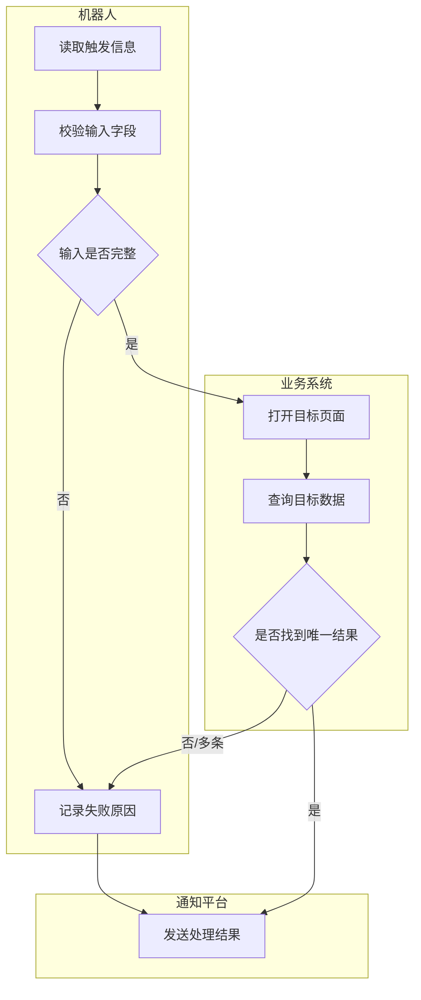

# Mermaid Swimlane Guide

Use Mermaid to express the RPA process as a cross-role flow. Prefer simple, valid, readable code over decorative complexity.

## Rules

- Use `graph TD`.
- Use one `subgraph` per role or platform, such as Robot, Feishu, Excel, ERP, Tax System, or Browser.
- Put every action node inside the responsible subgraph.
- Use node IDs with quoted Chinese descriptions: `A1["读取飞书消息"]`.
- Put decision nodes in the lane responsible for judging the condition: `D1{"是否找到唯一订单"}`.
- Label both success and failure branches.
- Use cross-lane links only when one role/platform sends information to another.
- Keep node text short. Put details in the analysis, not inside the diagram.

## Template

## Validation Checklist

Before returning Mermaid code, check:

- Does every branch have an ending?
- Are failure paths visible?
- Are cross-platform interactions explicit?
- Are repeated operations represented as loops or batch notes?
- Is the diagram still understandable without screenshots?
